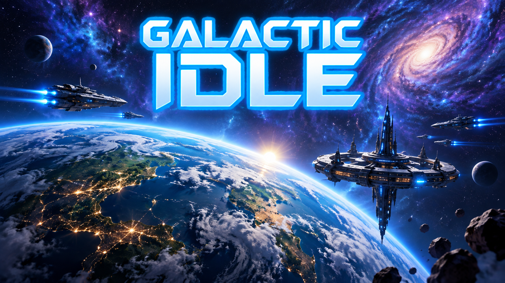

# RenderScribe Interactive

## Galactic Idle — a free idle 4X you play in your browser

**[▶ Play Galactic Idle free on itch.io](https://renderscribe-interactive.itch.io/galactic-idle)** — no signup, no download, works on desktop and mobile.

Restore a dying colony's power grid, automate it with a growing web of
structures, and expand across a **20-planet galaxy** through military
conquest or diplomacy. Galactic Idle blends idle/incremental progression with
real 4X decision-making — this isn't just number-go-up, it's tech trees,
fleet composition, faction diplomacy, and an economy that pushes back.

### Key features

- 5-resource economy with real offline progress
- 6-branch research tree with prerequisites
- Upkeep-based economy that creates genuine growth challenges, not just idle scaling
- Galaxy map with 20 planets and 5-faction diplomacy
- 17 expedition sectors with timed encounters
- Empire Dashboard with analytics and goal tracking
- 50 goals, adaptive music, and a lore timeline

Free, ad-free, no pay-to-win mechanics.

**Genre:** Strategy · 4X · Automation · Clicker · Idle · Incremental ·
Management · Sci-fi · Space · Singleplayer

---

### Links

- 🎮 Play: [renderscribe-interactive.itch.io/galactic-idle](https://renderscribe-interactive.itch.io/galactic-idle)
- 🔒 Privacy policy: [renderscribe.github.io/galactic-idle/privacy](https://renderscribe.github.io/galactic-idle/privacy/)

---

*RenderScribe Interactive is an independent game studio building Galactic Idle.*
